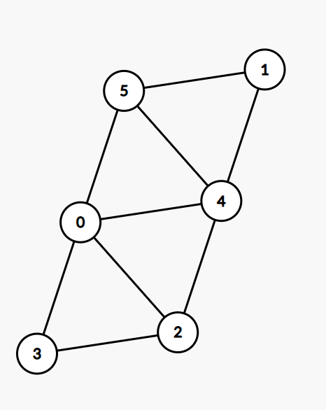

# Практика #1

Знакомство с Котлином, использование KoSAT.

### Создаём Котлин-проект в Intellij IDEA

1. `File->New->Project`
2. Указываем имя, нажимаем `Create`


### Примеры на Котлин

Ознакомьтесь со следующими примерами на языке Kotlin:

Hello world

```kotlin
fun main() {
    println("Hello world!")
}
```

Объявления переменных
```kotlin
fun main() {
    val a: Int
    // println(a)

    val b = 1
    // b++ CE
    var c = 0
    c++
    println(b == c) // true

    val hello = "Hello"
    val world = "world"
    println(hello + " " + world + "!") // Hello world!
    println("$hello $world!") // Hello world!

    val l: Long = 0

    val chr = '!'
    
    val (int1, int2) = listOf(10, 20)
    val (integer, string) = Pair(1337, "1337")
    
    val str: String?
    
    if (3 * 3 + 4 * 4 == 5 * 5) {
        str = null
    } else {
        str = "kak tak?.."
    }
    println(str) // null
    
    val matrix = arrayOf(arrayOf<Int>())
}
```

Функции

```kotlin
fun sum(a: Int, b: Int): Int {
    return a + b
}

fun mult(a: Int, b: Int) = a * b
```

Циклы

```kotlin
fun main() {
    var i = 0
    while (true) {
        if (i == 10) {
            break
        }
        i++
        if (i % 3 == 0) {
            continue
        }
        i++
    }
    
    for (i in 0 until 5) { // 0, 1, 2, 3, 4
        for (j in 0..2) { // 0, 1, 2
            println("($i, $j)")
        }
    }
    
    val primes = listOf(2, 3, 5, 7, 11, 13, 17)
    

    val x = 143
    
    for (p in primes) {
        if (x % p == 0) {
            println("Not prime!")
        }
    }
    println("Probably prime")
}

```

Ввод-вывод

```kotlin
fun main() {
    val n = readln().toInt()

    val (m, k) = readln().split(" ").map { it.toInt() }

    val arr = readln().split(" ").map { it.toInt() }

    val res = MutableList(arr.size) { 0 }

    for (i in res.indices) {
        res[i] = arr[i] * i * m + k
    }

    println("arr[i] * i * m + k =\n")
    println(res.joinToString(" "))
    println("Sum = ${res.sum()}")
}

```

Коллекции

```kotlin
fun main() {
    val t1 = listOf(1, 2, 3)
    // t1[0] = -1 CE
    val t2 = mutableListOf(1, 2, 3)
    t2[0] = -1
    
    val emptyList1 = emptyList<Int>()
    val emptyList2 = listOf<Int>()
    
    val setik = setOf(1, 1, 2)
    // setik.insert(3) CE
    val mutableSetik = setik.toMutableSet()
    mutableSetik.insert(3)
    println("${setik.size} ${mutableSetik.size}")

    val numbers = (0..10)
    val x2plus5 = numbers.map { it * 2 + 5 }
    println(x2plus5.toString())

    val allOdd = x2plus5.all { it % 2 != 0 }
    println(allOdd)

    val filtered = x2plus5.filter { it > 10 }
    println(filtered.toString())
}
```

Классы

```kotlin
class Person(
    val name: String,
    var age: Int
) {
    constructor(name: String) : this(name, 0) {
        println("A new baby was born")
    }

    fun birthday() {
        println("$name has a birthday today! He/She is ${++age} years old!")
    }
}
```


### Решаем задачу о раскраске графа

Попробуйте решить самостоятельно.

- Необходима зависимость на [KoSAT](https://github.com/UnitTestBot/kosat)

```
repositories {
    ...
    maven(url = "https://jitpack.io")
}

dependencies {
    ...
    implementation("com.github.UnitTestBot.kosat:kosat:65d3205c17")
}
```

- Пример использования:

```kotlin
import org.kosat.Kosat

fun main() {
// Create the SAT solver:
val solver = Kosat(mutableListOf(), 0)

    // Allocate two variables:
    solver.addVariable()
    solver.addVariable()

    // Encode TIE-SHIRT problem:
    solver.addClause(-1, 2)
    solver.addClause(1, 2)
    solver.addClause(-1, -2)
    // solver.addClause(1, -2) // UNSAT with this clause

    // Solve the SAT problem:
    val result = solver.solve()
    println("result = $result")

    // Get the model:
    val model = solver.getModel()
    println("model = $model")
}
```

- Проверьте решение на этом графе



### Решаем задачу о расстановке ферзей

Попробуйте решить эту задачу с помощью KoSAT самостоятельно.